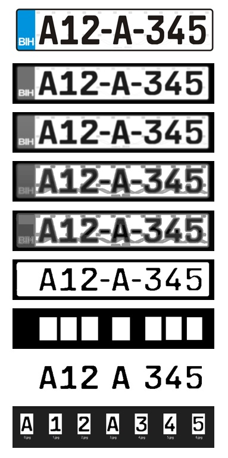

# ANPR Automatic number-plate recognition with KNearest 
ANPR KNearest creates jpeg img's from TTF font, trains and recognizes licence plate after cleaning and separating chars

   
  

### EXTRACT TTF FONT CHAR TO JPG
create font - single folder.py
>Extract jpg img's from TTF font chars 0-9 and A-Z in single folder as font-eu/0.jpg

create font - subfolders.py
>Extract jpg img's from TTF font in subfolders named  0-9 and A-Z with font name on every img as font/0/0-arial.jpg etc

### EXTRACTED JPG CHAR TRAINING
>training single font done and works
* training font in subfolders is not finished, have issues and need some help to finish this part

### LICENCE PLATE RECOGNIZE
recognize.py
* reads JPG img
* cleans img (results in temp folder)
* extracts chars (results in plate-contours folder)
* KNearest return values of nearest dists and shows result

Need asistance to finish "training - font in subfolders.py"
